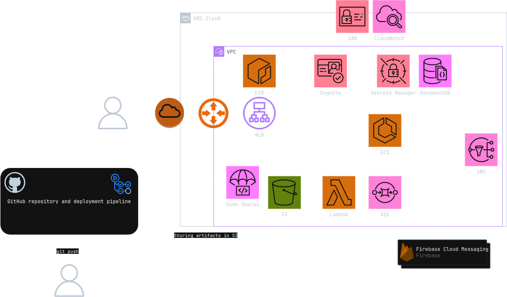

# Halftone 
### Photography sharing and ordering system for photographers and their clients.
### Features:
- **User Registration and Login**: Users can register and log in to the application.
- **Gallery Management**: Users can create and manage galleries, including setting options for photo processing.
- **Photo Upload**: Users can upload photos to the application.
- **Photo Management**: Users can view, download, and delete their uploaded photos.
- **Photo Sharing**: Users can share photos with clients via a unique link.
- **Photo Processing**: Photos are automatically processed (e.g., downscaled, watermarked) upon upload depending on gallery options.
- **Ordering**: Users can order shared photos for printing and add special requests.
- **Notifications**: Users receive push notifications for important events (e.g. receiving a new order).

Application infrastructure is hosted on AWS. Everything is managed using Terraform, Docker and GitHub Actions. It uses the following AWS services:

- **S3**: Photos, log and Terraform state storage
- **ECR**: Storage and management of Docker images
- **Application Load Balancer** - Distribution of
   network traffic, load balancing between instances
   Code Deploy - Deployment automation
- **Lambda** - Serverless computing, processing (e.g. downscaling and watermarking) and copying
   images uploaded to S3
- **SQS** - Message queue for inducing lambda calls (Proof of concept - the application will not exceed
   1000 simultaneous Lambda calls)
- **Cognito** - User pool management, support for registration and
   login
- **CloudWatch** - Resource monitoring, metrics and alerts (for ECS,
   Lambda and SQS), log collection (from ECS, Lambda)
- **IAM** - identity and access management, permissions
- **Secrets Manager** - Storage of    secrets.
- **DocumentDB** - Document database, compatible with MongoDB to
    ensure compatibility with the current data access layer
- **SNS** - Notifications and alerts
- **FCM - Firebase Cloud Messaging** - Additional external service used for web push notifications

